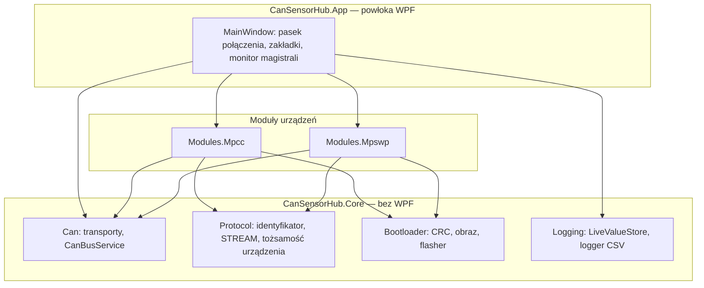

# Architektura

Rozwiązanie dzieli się na trzy warstwy: rdzeń niezależny od interfejsu
graficznego, moduły urządzeń oraz powłokę aplikacji.

## `CanSensorHub.Core`

Biblioteka klas bez zależności od WPF. Zawiera wszystko, co jest wspólne dla
każdego węzła magistrali.

| Przestrzeń | Zawartość |
|---|---|
| `Can` | `CanFrame`, transporty `SlcanTransport` i `SimulatedTransport`, `CanBusService` |
| `Protocol` | `CanId`, `Messages`, `Params`, `DeviceIdentity` |
| `Modules` | kontrakt modułu i rejestr typów modułów |
| `Logging` | `LiveValueStore`, `WideCsvLogger` |
| `Bootloader` | `Crc32`, `Crc16CcittFalse`, `FirmwareImage`, `BlCanLink`, `BootloaderFlasher` |

!!! note "Dlaczego rdzeń nie zna WPF"
    Interfejs `IDeviceModuleInstance` udostępnia widok modułu jako `object`,
    a nie `UIElement`. Dzięki temu projekt rdzenia nie musi odwoływać się do
    WPF, a rzutowanie wykonują projekty, które i tak od WPF zależą. Rozdział
    umożliwia testowanie warstwy protokołu bez uruchamiania interfejsu.

## Połączenie z magistralą

W danej chwili aktywne jest **jedno** połączenie, współdzielone przez wszystkie
dodane urządzenia. Tryby:

| Tryb | Zastosowanie |
|---|---|
| Adapter WeAct (slcan) | praca ze sprzętem, port COM, domyślnie 500 kbit/s |
| Symulator | praca bez sprzętu — fałszywe węzły w procesie aplikacji |

Dodanie urządzenia w trybie symulatora automatycznie uruchamia jego
odpowiednik na magistrali wirtualnej. Symulowany węzeł korzysta z tego samego
kodeka co węzeł rzeczywisty, więc rozbieżność między nimi nie jest możliwa —
poza zakresem celowo niezasymulowanym.

## Moduł urządzenia

Moduł jest osobnym projektem odwołującym się do rdzenia. Dostarcza:

| Element | Rola |
|---|---|
| tablice protokołu | kanały, czujniki, opcode'y, zdarzenia, rejestr parametrów |
| `XxxDeviceClient` | typowana warstwa żądań i odpowiedzi dla jednego węzła |
| `XxxDeviceViewModel` | implementacja `IDeviceModuleInstance` — widok i nagłówek zakładki |
| `XxxModuleDescriptor` | implementacja `IDeviceModuleDescriptor` — wpis w katalogu modułów |
| `XxxSimulator` | opcjonalnie: fałszywy węzeł do pracy bez sprzętu |

Każdy moduł udostępnia komplet podzakładek: pulpit z kartami wartości
i nagrywaniem CSV, wykresy na żywo, parametry, czujniki, status, czas RTC, log
zdarzeń oraz bootloader. Moduł MPCC ma dodatkowo zakładkę sterowania wyjściami,
moduł MPSWP — autokalibrację anteny detektora wyładowań.

## Monitor magistrali

Log wszystkich ramek nadanych i odebranych, **niezależny od modułów**: dekoduje
wyłącznie wspólną otoczkę `FUNC`/`NODE`/`OBJ`/`ARG`. Ruch węzła, dla którego nie
dodano modułu, jest zatem nadal widoczny i czytelny w zakresie warstwy wspólnej.

## Trwałość ustawień

Tryb połączenia, port, przepływność i lista dodanych urządzeń zapisywane są
w `%AppData%\CanSensorHub\settings.json` i przywracane przy starcie, po
ponownym nawiązaniu połączenia.
