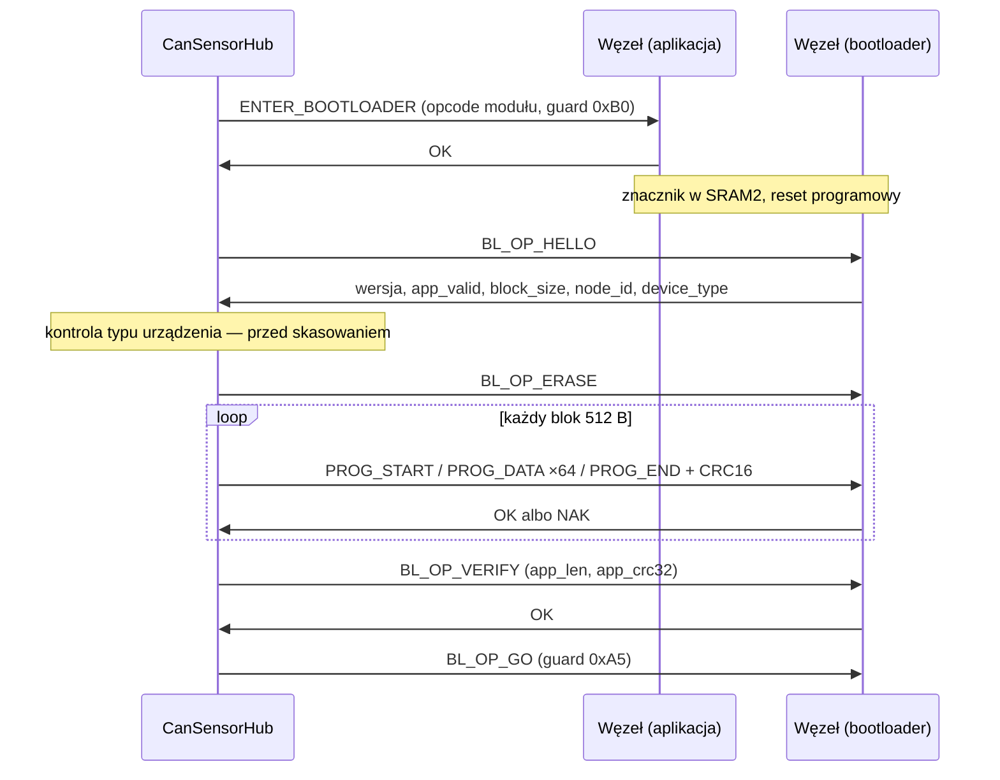

# Narzędzie bootloadera

Programowanie firmware węzłów odbywa się przez CAN, przez adapter. Narzędzie
jest wspólne dla wszystkich modułów — protokół bootloadera należy do warstwy
wspólnej i jest identyczny na każdym węźle.

Kontrakt komunikacyjny opisuje
[dokumentacja wspólnej bazy](https://github.com/bartkepl/CanBusCommon/blob/main/bootloader/README.md).

## Przebieg



## Kontrola typu urządzenia

Bootloader od wersji 1.1 zgłasza `DEVICE_TYPE` w odpowiedzi `HELLO`. Narzędzie
porównuje tę wartość z typem, dla którego przeznaczony jest obraz, i przy
niezgodności **przerywa wgrywanie przed skasowaniem pamięci**.

```csharp
if (expectDeviceType is { } expected && reported != expected)
    throw new BootloaderException(
        $"Bootloader zgłasza typ urządzenia 0x{reported:X4}, a obraz jest przeznaczony " +
        $"dla 0x{expected:X4}. Wgrywanie przerwane przed skasowaniem pamięci.");
```

!!! danger "Dlaczego odmowa, a nie ostrzeżenie"
    Obraz jednego typu węzła wgrany do innego **wystartuje** — sprzęt jest ten
    sam — lecz będzie sterował niewłaściwymi peryferiami. Stan taki nie zgłasza
    się sam: węzeł odpowiada na magistrali i wygląda na sprawny. Odmowa jest
    zatem jedynym momentem, w którym błąd da się wykryć bezkosztowo.

Bootloader wersji 1.0 typu nie podaje; kontrola jest wtedy pomijana, ponieważ
brak informacji nie jest tym samym co informacja o niezgodności.

Adres, na którym nasłuchuje bootloader, jest **wkompilowany w jego obraz**
i niezależny od `NODE_ID` skonfigurowanego w aplikacji. Moduł podaje obie
wartości: `BootloaderNodeId` oraz bieżący adres aplikacji, o który narzędzie
pyta osobno.

## Kolejność operacji

Kontrola typu poprzedza kasowanie. Kolejność ta jest istotna: po skasowaniu
slotu aplikacji jedyną drogą naprawy jest wgranie właściwego obrazu, co przy
błędnie wybranym węźle nie zawsze jest oczywiste. Przed kasowaniem odmowa nie
pozostawia żadnych skutków.

Weryfikacja (`BL_OP_VERIFY`) następuje po zaprogramowaniu całości i przed
skokiem do aplikacji. Umożliwia to potwierdzenie bajtowej tożsamości obrazu
**również przed nadpisaniem** — narzędzie może zweryfikować obraz dotychczasowy,
co jest jedyną kontrolą stwierdzającą, że archiwum odpowiada temu, co pracuje
w module.

## Odzyskiwalność

Bootloader ma trzy niezależne drogi wejścia w tryb programowania, a jedyną
operacją nieodwracalną jest zapis stron 0–7 pamięci — którego żadna procedura
aktualizacji nie wykonuje. Węzeł pozostaje zatem odzyskiwalny na każdym etapie,
także w obudowie zalanej.

Procedurę dla modułu bez dostępu do SWD opisuje
[`UPDATE_SEALED.md`](https://github.com/bartkepl/CanBusCommon/blob/main/docs/UPDATE_SEALED.md).

## Ograniczenia

- Programowanie odbywa się wyłącznie przez CAN; ścieżka UART została usunięta
  z aplikacji jako nieużywana. Sam bootloader transport UART zachowuje.
- Symulator nie implementuje bootloadera. W trybie symulatora zakładka pozwala
  wysłać `ENTER_BOOTLOADER`, lecz dalsze kroki wymagają węzła rzeczywistego.

Zagadnienia niezawodności tej ścieżki opisuje osobno
[Niezawodność wgrywania](BOOTLOADER_ROBUSTNESS.md).
