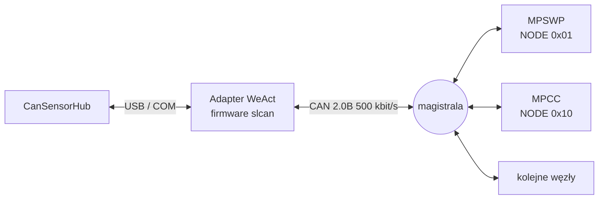

# CanSensorHub

Modularna aplikacja PC (.NET 10 / WPF) obsługująca czujnikowe i sterujące węzły
magistrali CAN. Zarządza **jednym połączeniem** z adapterem, udostępnia surowy
log ruchu, a każde urządzenie obsługuje przez osobny, wpinany moduł.

-   :material-lan-connect: __Jedno połączenie, wiele węzłów__

    Adapter WeActStudio USB2CANFDV1 we firmware slcan albo transport
    symulowany. Węzły rozróżniane polem `NODE`, każdy jako osobna zakładka.

-   :material-puzzle: __Moduły urządzeń__

    MPCC i MPSWP na start, kolejne przez implementację jednego interfejsu.
    Wspólna otoczka protokołu jest już w rdzeniu.

-   :material-chip: __Narzędzie bootloadera__

    Programowanie firmware przez CAN, z kontrolą typu urządzenia **przed**
    skasowaniem pamięci.

-   :material-monitor-eye: __Monitor magistrali__

    Surowy log ramek nadawanych i odbieranych, niezależny od modułów,
    z pauzą, filtrem i eksportem do CSV.

## Rola w ekosystemie

Aplikacja jest **warunkiem wstępnym aktualizacji firmware** węzłów: wgrywanie
odbywa się przez jej narzędzie bootloadera, a po starcie węzła to ona dekoduje
ramkę identyfikacyjną i telemetrię.

Protokół jest wspólny dla wszystkich węzłów i opisany w repozytorium
[CanBusCommon](https://github.com/bartkepl/CanBusCommon). Aplikacja implementuje
go po stronie hosta w języku C#; węzły i hosty pythonowe korzystają z kodu
generowanego z tego samego opisu.

## Stan

| Element | Stan |
|---|---|
| Obsługa profilu 2 | gotowa — ramka identyfikacyjna 4/21/28 B, `CAPABILITIES`, komendy 0x12–0x16 |
| Moduł MPSWP | przeniesiony na profil 2, zweryfikowany na sprzęcie |
| Moduł MPCC | w trakcie migracji wraz z firmware węzła |
| Narzędzie bootloadera | odczyt typu urządzenia z odpowiedzi `HELLO` wersji 1.1, odmowa wgrania obrazu niewłaściwego typu |
| Składanie transferów segmentowanych | odporne na kolejność, transfer niekompletny porzucany |
| Kompilacja rozwiązania | 0 błędów, 0 ostrzeżeń |

Aktualizacja firmware 3.1 stacji pogodowej została wykonana tym narzędziem
i potwierdzona odczytem ramki identyfikacyjnej po starcie.

!!! info "Repozytorium przed ujednoliceniem"
    Praca nad aplikacją nie była wcześniej objęta kontrolą wersji —
    repozytorium istniało bez żadnego commita. Stan ten został usunięty wraz
    z migracją na profil 2.
