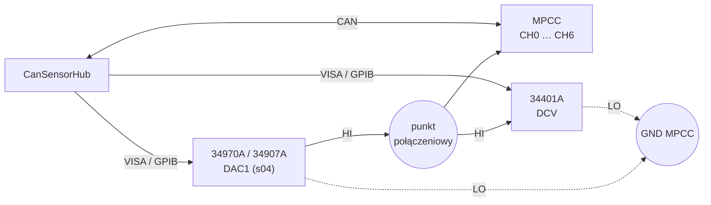

# Kalibracja wejść napięciowych MPCC

Narzędzie wyznacza współczynniki korekcji `c0` i `c1` siedmiu wejść
napięciowych (AFE) węzła MPCC na podstawie pomiarów wzorcowych, zapisuje je do
węzła i potwierdza wynik sprawdzeniem wielopunktowym. Otwierane jest z menu
**Narzędzia → Kalibracja wejść napięciowych MPCC…** okna głównego.

Kalibracja jest czynnością okazjonalną i wymaga stanowiska pomiarowego, dlatego
narzędzie jest osobnym, wyłączalnym projektem, a nie zakładką modułu
([ADR 0001](adr/0001-narzedzia-jako-osobne-projekty.md)).

## Stanowisko

| Element | Rola |
|---|---|
| Agilent 34970A z kartą 34907A | zadajnik: wyjście DAC (±12 V, rozdzielczość 1 mV) |
| HP 34401A | wzorzec: pomiar napięcia w punkcie połączeniowym |
| Adapter USB–GPIB | dostęp do obu przyrządów przez VISA |
| NI-VISA albo Keysight IO Libraries | biblioteka `visa64.dll` |
| Adapter CAN (slcan) | połączenie z węzłem, jak przy zwykłej pracy |



Wymagania dotyczące połączeń:

- **Multimetr mierzy w punkcie połączeniowym**, bezpośrednio przy zaciskach
  węzła. Spadek napięcia na przewodzie od zadajnika nie wchodzi wtedy do wyniku,
  bo wzorcem jest napięcie faktycznie obecne na wejściach.
- **Zaciski LO obu przyrządów są dołączone do masy węzła w jednym punkcie.**
  Oddzielne ścieżki powrotne tworzą pętlę masy, której spadek napięcia dodaje
  się do mierzonego.
- **Wszystkie kalibrowane wejścia są połączone równolegle.** Jeden przebieg
  kalibruje wszystkie wybrane kanały. Górna granica zakresu nie może przekraczać
  zakresu najmniejszego z dołączonych wejść.

!!! warning "Kanały 0–3 a pełna skala ADC"
    Dzielnik 25k/15k przy 5 V na wejściu daje na pinie ~3,0 V, czyli pełną skalę
    ADC (VDDA ≈ 3,0 V, referencja LM4040). Tolerancja dzielnika może wprowadzić
    przetwornik w nasycenie przed osiągnięciem 5 V. Domyślna górna granica
    zakresu wynosi 4,8 V. Punkty w nasyceniu są wykrywane i pomijane.

!!! note "Kanały 4–6 przy zakresie 5 V"
    Kanały o zakresie ~30 V, kalibrowane napięciem do 5 V, są skorygowane
    w dolnej jednej szóstej zakresu. Korekcja wzmocnienia ekstrapoluje się na
    cały zakres, ale jej niepewność powyżej 5 V nie jest potwierdzona
    sprawdzeniem.

## Model korekcji w węźle

Firmware MPCC przelicza napięcie na pinie ADC na napięcie wejściowe według
modelu

```
V = k · (c1 · V_pin + c0),    k = 1 + tc · (T − Tref)
```

z parametrami kanału `CAL_ADCn_C0`, `CAL_ADCn_C1`, `CAL_ADCn_TC`, wspólnym
`CAL_ADC_TREF` i temperaturą płytki `T` z czujnika STS31.

Węzeł udostępnia wyłącznie wynik przeliczenia (`READ_ADC`, 1 mV). Narzędzie
dopasowuje prostą `V_ref = a · V + b` do odczytów wykonanych przy bieżących
współczynnikach i wylicza nowe przez złożenie:

```
c1' = a · c1
c0' = a · c0 + b / k
tc' = tc
```

Uzasadnienie i odrzucone warianty:
[ADR 0004](adr/0004-wspolczynniki-z-odczytow-skalibrowanych.md). Wynik nie
zależy od stanu wyjściowego współczynników. Ponowna kalibracja węzła już
skalibrowanego daje `a ≈ 1` i `b ≈ 0`.

## Przebieg

1. **Połączenie i urządzenie.** W oknie głównym nawiązać połączenie z magistralą
   i dodać urządzenie MPCC. Narzędzie korzysta z tego samego połączenia.
2. **Przyrządy.** *Wyszukaj przyrządy* — narzędzie wyszukuje adresy GPIB, USB
   i LAN, wysyła do każdego `*IDN?` i podpowiada przypisanie 34401A oraz 34970A.
   Porty szeregowe są pomijane, chyba że operator zaznaczy je jawnie.
   Zapytanie identyfikacyjne na porcie innego urządzenia, w tym adaptera CAN,
   zakłóca jego pracę. Przed pomiarem narzędzie sprawdza, czy we wskazanym
   gnieździe jest karta 34907A.
3. **Węzeł.** *Odczytaj* — identyfikacja węzła (UID, wersja firmware), bieżące
   współczynniki, `MEASURE_PERIOD`, `Tref` i stan blokady `CAL_LOCK`.
4. **Kalibracja.** Dla każdego punktu: nastawa DAC, ustalenie, równoległa seria
   odczytów multimetru i rundy `READ_ADC` wszystkich wybranych kanałów, kontrola
   rozrzutu wzorca (z powtórzeniem punktu), temperatura płytki. Po ostatnim
   punkcie DAC wraca do 0 V — również po przerwaniu i po błędzie.
5. **Zestawienie.** Tabela pokazuje dla każdego kanału `a`, `b`, residua
   dopasowania oraz współczynniki bieżące i nowe. Kanał jest odrzucany z opisem
   przyczyny, gdy:
    - residuum dopasowania przekracza tolerancję sprawdzenia — tor nie jest
      liniowy w zakresie kalibracji, a korekcja liniowa tego nie usunie;
    - korekcja jest nierealna (domyślnie powyżej 5 % wzmocnienia albo 100 mV
      przesunięcia), co wskazuje zwykle błąd połączeń.
6. **Zapis.** Po zaznaczeniu pola zatwierdzenia — *Zapisz do węzła i sprawdź*.
7. **Sprawdzenie.** Automatycznie po zapisie, w punktach leżących między punktami
   kalibracji. Wynik PASS/FAIL na kanał względem tolerancji. Sprawdzenie można
   też uruchomić samodzielnie (*Tylko sprawdzenie*) jako weryfikację okresową,
   bez zmiany współczynników.

## Zapis do węzła

Kolejność kroków
([ADR 0005](adr/0005-sekwencja-zapisu-kalibracji.md)):

1. `CAL_LOCK = 0` (tylko RAM).
2. `c1` i `c0` każdego przyjętego kanału; każdy zapis musi zwrócić `OK`.
3. Odczyt zwrotny i porównanie z wartościami wysłanymi (na poziomie `float`).
4. `CAL_LOCK = 1`.
5. `SAVE_CONFIG` — nowe współczynniki i blokada trafiają do pamięci
   nieulotnej jednocześnie.
6. Kontrola `CAL_LOCK = 1`.

Niepowodzenie przed `SAVE_CONFIG` przywraca poprzednie współczynniki
i blokadę, bez zapisu do pamięci nieulotnej. Stan pamięci nieulotnej węzła
pozostaje wtedy niezmieniony.

!!! warning "`SAVE_CONFIG` utrwala całą konfigurację"
    Zmiany innych parametrów węzła wykonane wcześniej w RAM i niezapisane
    zostaną utrwalone razem z kalibracją.

## Ustawienia

| Ustawienie | Domyślnie | Znaczenie |
|---|---|---|
| Zakres | 0,1 … 4,8 V | napięcia zadawane; ograniczone też do ±12 V DAC |
| Kalibracja | wielopunktowa, 5 pkt | dwupunktowa: krańce zakresu, prosta dokładna; wielopunktowa: najmniejsze kwadraty, residua ujawniają nieliniowość |
| Punkty sprawdzenia | 6 | leżą w połowie między punktami siatki |
| Wzorzec — próbki | 10 | seria jednym wyzwoleniem (`SAMP:COUN`), maks. 512 |
| NPLC | 10 | od 10 wzwyż tłumienie przydźwięku sieci |
| Autozero | wł. | kompensacja dryfu offsetu, dwukrotnie dłuższy odczyt |
| Węzeł — rundy odczytu | 10 | rundy `READ_ADC` na punkt |
| Odstęp rund | 0 = `MEASURE_PERIOD` | krótszy odstęp odczytuje wielokrotnie tę samą próbkę |
| Ustalanie | 0 = 2 × `MEASURE_PERIOD` + 500 ms | czas po zmianie nastawy |
| Maks. σ wzorca | 0,5 mV | powyżej — powtórzenie punktu |
| Maks. prób punktu | 3 | po wyczerpaniu punkt jest przyjmowany z ostrzeżeniem |
| Tolerancja sprawdzenia | 5 mV | kryterium PASS; także największe dopuszczalne residuum dopasowania |
| Maks. korekcja wzmocnienia | 0,05 | \|a − 1\|; powyżej — kanał odrzucony |
| Maks. korekcja przesunięcia | 100 mV | \|b\|; powyżej — kanał odrzucony |

Multimetr pracuje na stałym zakresie 10 V z impedancją wejściową powyżej
10 GΩ (`INP:IMP:AUTO ON`).

Rozdzielczość `READ_ADC` wynosi 1 mV. Rozdzielczość poniżej 1 mV wynika
z uśredniania rund, w których szum toru ADC działa jak dither. Wydłużenie
serii zmniejsza niepewność średniej proporcjonalnie do `1/√n`.

Ustawienia są zapisywane w `%AppData%\CanSensorHub\tools\mpcc-afe-cal.json`.

## Raport

Każda operacja zapisuje raport CSV w `%AppData%\CanSensorHub\calibration\`,
o nazwie `MPCC-AFE_<UID>_<data>-<czas>.csv`. Kolejne operacje jednej sesji
(kalibracja, zapis i sprawdzenie) uzupełniają ten sam plik.

| Sekcja | Zawartość |
|---|---|
| `[Sesja]` | wersja narzędzia, tryb, węzeł (NODE, UID, firmware), przyrządy (`*IDN?`), `Tref`, `MEASURE_PERIOD` |
| `[Ustawienia]` | parametry przebiegu |
| `[Wspolczynniki przed]` | stan węzła przed operacją |
| `[Punkty kalibracji]` | nastawa, średnia i σ wzorca, temperatura, średnia, σ i liczność serii każdego kanału |
| `[Dopasowanie]` | `a`, `b`, R², residuum maksymalne, `k`, współczynniki przed i po, decyzja |
| `[Zapis do wezla]` | wynik i dziennik kroków |
| `[Punkty sprawdzenia]`, `[Sprawdzenie]` | dane surowe i wynik PASS/FAIL na kanał |

Raport zawiera dane surowe, co pozwala przeliczyć kalibrację innym modelem bez
powtarzania pomiarów.

## Tryb symulatora

W trybie symulatora zadajnik i multimetr są symulowane i dołączone do wejścia
analogowego magistrali symulowanej. Symulowany węzeł MPCC ma dzielniki
z błędami rzędu 0,5 % i przesunięciami rzędu miliwoltów, szum toru ADC oraz
egzekwuje blokadę `CAL_LOCK` jak firmware. Przebieg, zapis i raport są
identyczne jak na stanowisku.

## Budowanie bez narzędzia

Narzędzie jest dołączane domyślnie. Build bez narzędzi serwisowych:

```powershell
./build_release.ps1 -NoTools
dotnet publish src/CanSensorHub.App/CanSensorHub.App.csproj -c Release -p:WithTools=false
```

Aplikacja zbudowana w ten sposób nie pokazuje przycisku „Narzędzia”.
